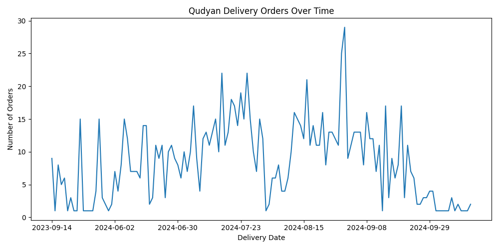

# Qudyan Delivery Order Analytics

This project analyzes real-world order data from Qudyan Delivery using SQL and Python.

## Objective
The goal of this project is to explore order trends, revenue patterns, and delivery performance.

## Dataset Overview
- Orders dataset: 1,152 rows
- Customers dataset: 1,968 rows (anonymized for portfolio use)

## Dataset
The project uses two datasets derived from Qudyan Delivery operations.

### Orders Dataset
Contains information about delivery orders including:
- order_id
- order_amount
- payment_status
- order_status
- payment_method
- created_at
- delivery_date
- delivery_time

### Customers Dataset
Contains anonymized customer information used for analysis:
- customer_id
- first_name
- last_name
  
## Example Insights

From the analysis we can identify:

- Total number of orders
- Average order value
- Distribution of order status (delivered vs cancelled)
- Payment behavior of customers
- Daily order trends

These insights help understand operational performance and customer behavior in the delivery platform.

## Key Questions
- How many orders were placed?
- What is the average order value?
- What percentage of orders were delivered or canceled?
- How does payment status vary across orders?
- What trends can be observed over time?

## Tools Used
- SQL
- Python
- Pandas
- Matplotlib

## Files
- `qudyan_orders_portfolio.csv`
- `qudyan_customers_portfolio.csv`
- `qudyan_sql_queries.sql`
- `qudyan_analysis.py`
- `insights.md`
## Orders over time

