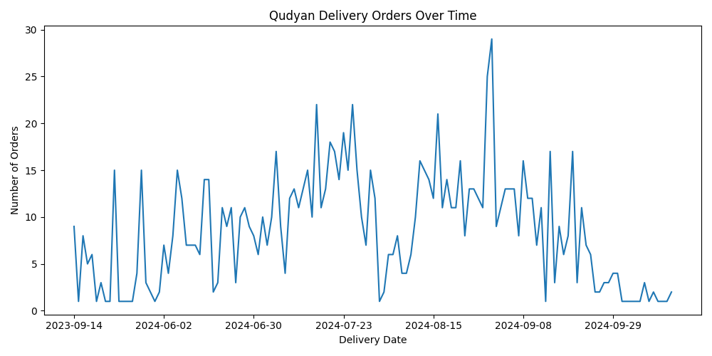

# Qudyan Delivery — Operations Analytics

Portfolio analysis of **real Qudyan Delivery operational data** using SQL and Python to examine order activity, revenue-related performance, payment behavior, cancellations, and demand patterns.

## Business Context

Qudyan Delivery operates a multi-service delivery platform. This project uses an anonymized portfolio dataset to show how operational data can support day-to-day business decisions such as staffing, demand planning, cancellation monitoring, and payment follow-up.

## Business Questions

- How many orders were placed?
- What is the average order value?
- Which order statuses appear most frequently?
- How do paid and unpaid orders compare?
- Which order types generate the most activity?
- How does order volume change over time?
- Where should operations teams investigate cancellations or service issues?

## Dataset

The repository contains two portfolio datasets derived from Qudyan Delivery operations:

- **Orders:** 1,152 records
- **Customers:** 1,968 anonymized records

Key order fields include order ID, order amount, payment status, order status, payment method, order type, creation date, delivery date, and delivery time.

## Analysis Approach

### SQL

The SQL analysis covers total orders, delivered-order revenue, average order value, order-status distribution, payment-status distribution, order-type distribution, and daily order volume.

See **qudyan_sql_queries.sql**.

### Python

The Python workflow uses **Pandas** for analysis and **Matplotlib** for visualization. It reviews dataset structure, calculates summary metrics, evaluates order and payment distributions, and plots order volume over time.

See **qudyan_analysis.py**.

## Key Findings

- The dataset contains **1,152 orders**.
- Delivered orders are the primary source of realized order revenue.
- Order-status analysis can help surface cancellation and operational issues.
- Payment-status monitoring can support follow-up on paid versus unpaid orders.
- Order-volume trends can support staffing and delivery-capacity planning.

These findings are summarized in **insights.md**.

## Operational Recommendations

- Monitor canceled orders and investigate recurring causes.
- Track daily order volume to identify peak periods.
- Align staffing and delivery capacity with high-demand periods.
- Review payment and order-status patterns as operating KPIs.
- Use recurring trend analysis to support dispatch and service decisions.

## Visualization

### Orders Over Time

## Tools

**SQL · Python · Pandas · Matplotlib**

## Repository Contents

| File | Purpose |
|---|---|
| Qudyan _orders_portfolio.csv | Portfolio orders dataset |
| Qudyan_customers_portfolio.csv | Anonymized customer dataset |
| qudyan_sql_queries.sql | SQL KPI and distribution analysis |
| qudyan_analysis.py | Python analysis and visualizations |
| insights.md | Findings and recommendations |
| Orders_over_time_chart.png | Order-volume visualization |

## Portfolio Note

This repository demonstrates an operations-analytics workflow using business data. Customer information has been anonymized for portfolio use.
